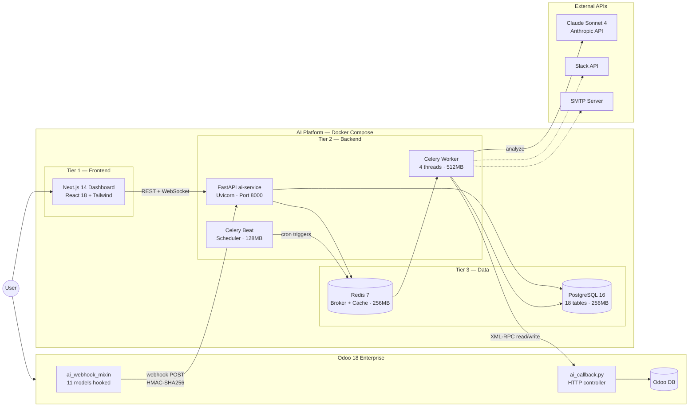
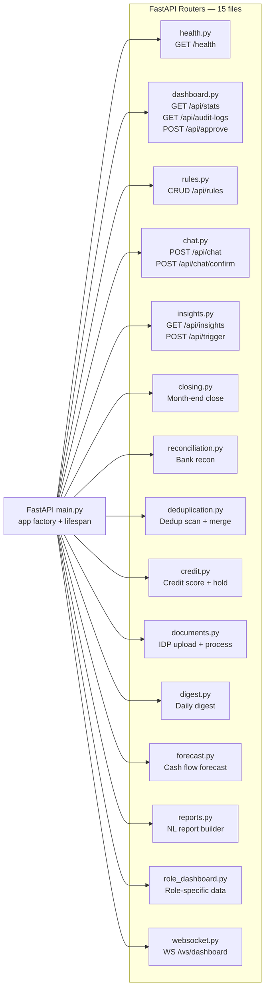
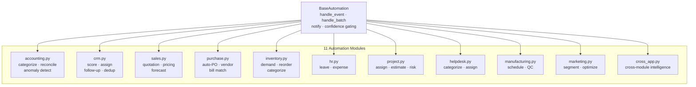
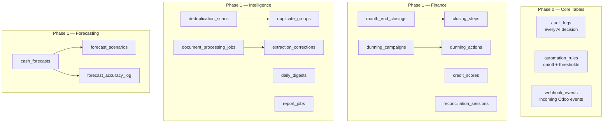
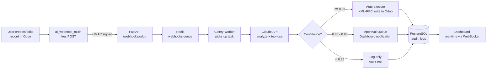
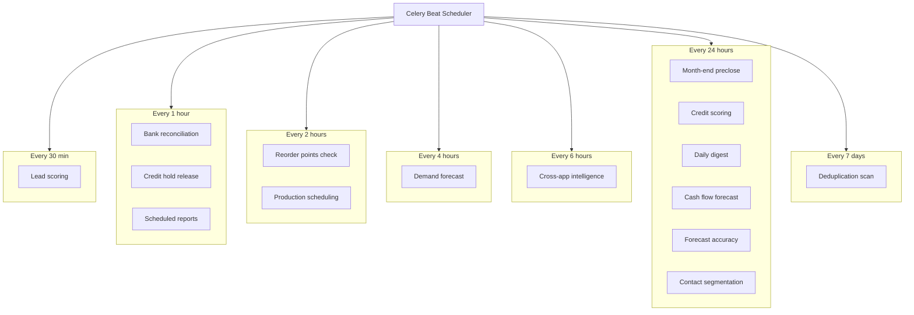
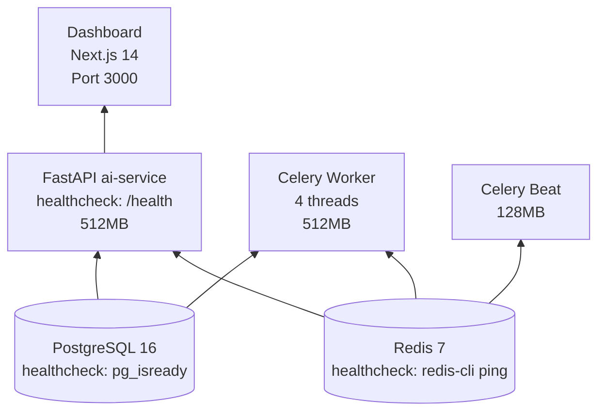
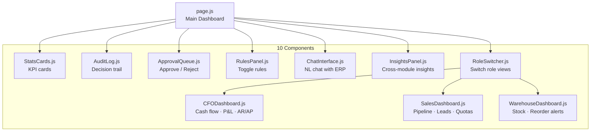
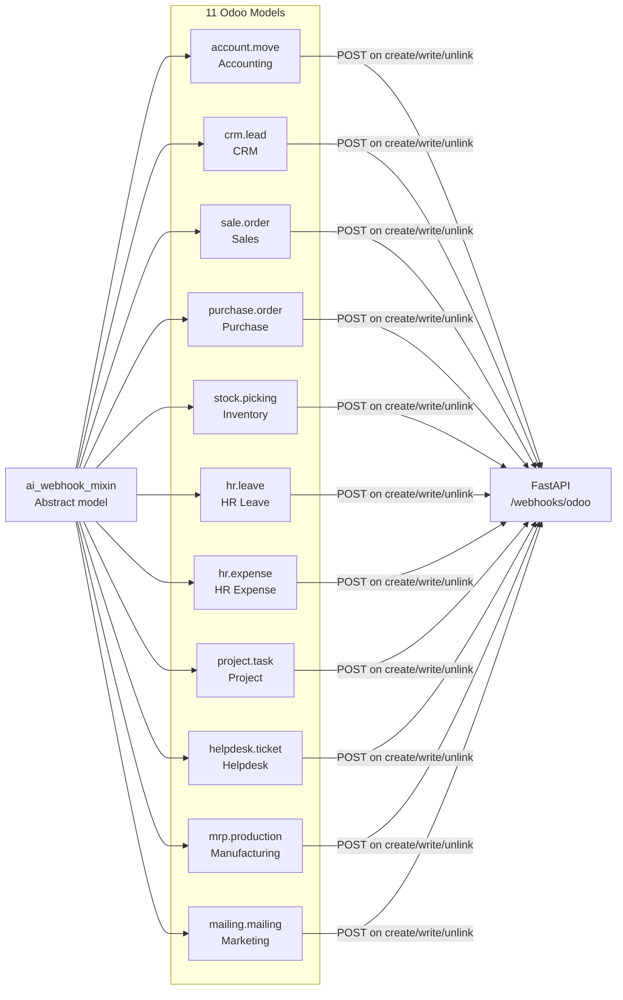
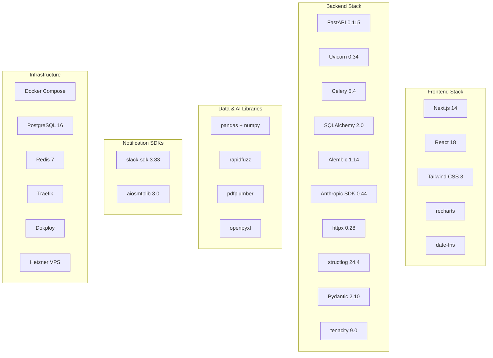

# Smart Odoo — Full Architecture Map

## 1. System Overview — 3 Tiers

## 2. Backend — Routers (Controllers)

## 3. Backend — Automation Modules

## 4. Database — 18 Tables

## 5. Webhook Lifecycle — Data Flow

## 6. Celery Beat — 15 Scheduled Tasks

## 7. Docker Services — Startup Order

## 8. Frontend — Dashboard Components

## 9. Odoo Bridge — Hooked Models

## 10. Tech Stack Summary

