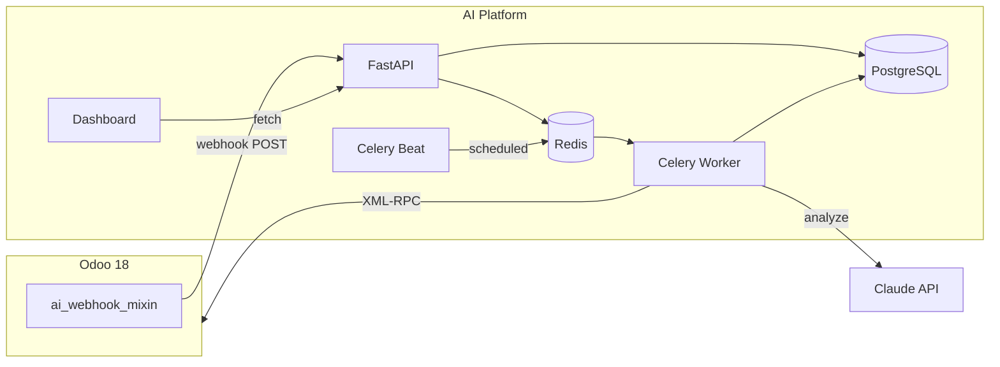
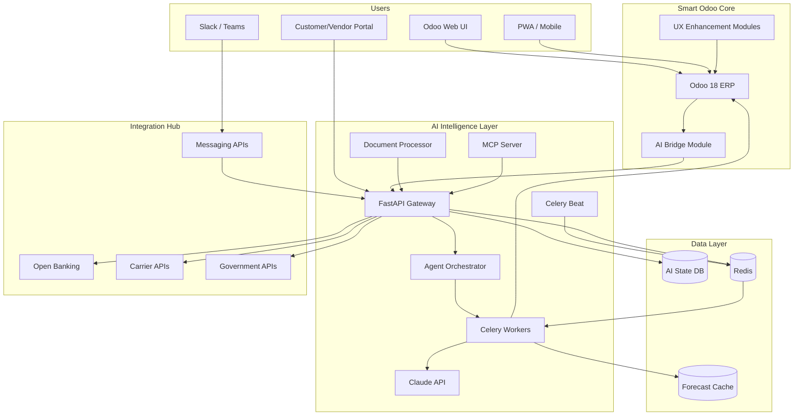

# Smart Odoo -- Master Plan

**The definitive roadmap for transforming standard Odoo into an AI-native ERP platform.**

This document is the single source of truth for all project end goals. Every feature, enhancement, and capability -- whether planned, in progress, or completed -- is tracked here. All other `.md` files in this repository are supporting research and detail documents referenced from this plan.

---

## Vision

Smart Odoo is not a plugin. It is a **complete Odoo ERP deployment** with an AI intelligence layer, UX enhancements, and new capabilities built directly into the experience. Users get everything standard Odoo offers, plus an autonomous AI layer that handles the tedious work, surfaces the right information at the right time, and connects the dots across modules that Odoo's siloed architecture cannot.

The goal: deliver an ERP that competes with SAP S/4HANA + Joule, NetSuite Next, and Microsoft Dynamics 365 + Copilot on intelligence -- while keeping Odoo's cost advantage, open-source flexibility, and implementation speed.

**What users experience:**
- Every manual, repetitive task is handled by AI or reduced to a single approval click
- The system tells you what needs attention instead of making you hunt for it
- Cross-module workflows (quote -> delivery -> invoice -> payment -> reconciliation) are seamless, not 5 separate screens
- Business users can build their own automations without developers
- External systems (banks, shipping, messaging) are connected natively
- Customers and vendors have self-service portals instead of email/phone chains

---

## The Six Pillars

All enhancements are organized into six pillars. Each pillar addresses a distinct category of user pain, competitive gap, or technology trend.

---

### Pillar 1: AI Automation Layer

> Source: [WHAT_WE_AUTOMATE.md](WHAT_WE_AUTOMATE.md), [ODOO_PAIN_POINTS.md](ODOO_PAIN_POINTS.md)

#### 1A. Existing Automations (Phase 0 -- DEPLOYED)

10 module automations already built and operational:

| Module | Automations |
|--------|------------|
| Accounting | Transaction categorization, bank reconciliation, anomaly detection |
| CRM | Lead scoring, auto-assignment, follow-up generation, duplicate detection |
| Sales | Quotation generation, pricing optimization, pipeline forecasting |
| Purchase | Auto-PO creation, vendor selection, bill matching |
| Inventory | Demand forecasting, auto-reorder, ABC product categorization |
| HR | Leave approval, expense processing |
| Project | Task assignment, duration estimation, risk detection |
| Helpdesk | Ticket categorization, auto-assignment, solution suggestion |
| Manufacturing | Production scheduling, quality monitoring |
| Marketing | Contact segmentation, campaign optimization |
| Cross-App | Cross-module intelligence engine (runs every 6 hours) |

#### 1B. New Automations to Add

7 high-impact automations identified from user pain point research:

| # | Automation | Time Saved | Priority |
|---|-----------|-----------|----------|
| 1 | Month-End Closing Assistant -- AI-powered checklist tracking all 8+ closing steps, auto-detecting unreconciled items, stale drafts, missing bills, unposted depreciation | 25-50 hrs/month | CRITICAL |
| 2 | Enhanced Bank Reconciliation -- fuzzy matching for partial refs/rounding, session memory across reconciliation sessions, intermediate account cleanup, learning from manual matches | 15-20 hrs/month | HIGH |
| 4 | Smart Invoice Processing -- OCR validation against PO data, fuzzy vendor matching, line-item cross-checking, multi-invoice batch processing, auto-categorization of non-PO expenses | 6+ hrs/batch | HIGH |
| 5 | Cross-Entity Deduplication -- scans contacts, leads, products, vendors using fuzzy matching (name, email, phone, address), suggests merges, blocks duplicates at creation time | 3-5 hrs/week | HIGH |
| 6 | Customer Credit Management -- monitors AR aging, auto-enforces credit limits on SO creation, AI credit scoring, alerts to sales reps, auto-releases holds on payment | 2-3 hrs/week | HIGH |
| 7 | Natural Language Report Builder -- chat generates formatted reports from plain English, scheduled delivery, PDF/Excel export, period comparison | 2-4 dev days/report | HIGH |

#### 1C. Agentic AI Architecture Upgrade

Current architecture: each automation is a single-action handler (event -> analyze -> act).

Target architecture: **multi-step autonomous agents** that chain actions across modules, matching the approach SAP Joule and Microsoft Dynamics 365 Copilot use in 2026.

Example agent workflow:
1. Detect low stock on Product X
2. Check sales pipeline for upcoming orders requiring Product X
3. Evaluate 3 suppliers on price, lead time, and reliability score
4. Create PO with optimal supplier and quantity
5. Notify purchasing manager via Slack with summary and approval link
6. On approval, confirm PO and schedule follow-up for delivery tracking

This requires upgrading from isolated Celery tasks to an **agent orchestration layer** where agents maintain state across multi-step workflows and can branch based on intermediate results.

#### 1D. AI-Powered Onboarding & Contextual Help

70% of Odoo users don't discover features they're paying for. The AI becomes a training assistant:

- "How do I set up fiscal positions?" -> step-by-step guide with direct links to the right screen
- "What's the difference between FIFO and average costing?" -> explanation with recommendation based on the user's business type
- Proactive tips: "You've been manually entering bank transactions. Did you know you can import bank statements automatically?"
- Interactive setup wizards for first-time module configuration

---

### Pillar 2: UX/UI Overhaul

> Source: [ODOO_UX_PAIN_POINTS.md](ODOO_UX_PAIN_POINTS.md)

#### 2A. Day-1 Fixes (Must-have)

| Fix | Problem It Solves |
|-----|-------------------|
| Global Search across all modules | Users waste 5-10 min/day navigating menus to find records |
| Auto-save feedback + edit/view mode clarity | Users accidentally change data without realizing |
| Dark mode (native) | Standard feature in 2026, missing from Odoo |
| Unified Activity Center ("My Day") | Activities scattered per-record, deadlines get missed |
| Customer 360 view | No single view of a contact's invoices + orders + tickets + projects |

#### 2B. Role-Based AI Dashboards

Replace the one-size-fits-all dashboard with personalized views:

| Role | Dashboard Shows |
|------|----------------|
| CFO / Controller | Cash flow forecast, P&L summary, AR/AP aging, compliance alerts, month-end close status |
| Sales Manager | Pipeline by stage, lead conversion rates, rep performance, at-risk deals, quota progress |
| Sales Rep | My leads (AI-ranked), pending quotations, follow-up reminders, product suggestions |
| Warehouse Manager | Stock levels with demand forecast, incoming shipments, reorder alerts, anomalies |
| HR Manager | Pending approvals (leave/expense), headcount trends, upcoming leave conflicts |
| Project Manager | Project health scores, overdue tasks, resource utilization, risk alerts |
| Support Lead | Ticket queue by priority, SLA status, agent workload, trending issues |

#### 2C. Proactive AI Daily Digest

AI-curated briefing delivered each morning per user:

- What needs your attention today (overdue items, pending approvals, at-risk deals)
- Key metrics vs. yesterday (new leads, revenue, stock alerts)
- Anomalies detected overnight (unusual transactions, failed automations)
- Delivery via user's preferred channel: email, Slack, or in-app

#### 2D. High-Priority UX Improvements

- Settings search/discoverability (command palette that surfaces all settings)
- Notification intelligence (priority levels, digest mode, smart filtering)
- Form view progressive disclosure (essential fields first, advanced on demand)
- Data import wizard redesign (drag-drop, auto-detect columns, preview + validation)
- PDF report engine upgrade (replace wkhtmltopdf with modern renderer)
- Central approval inbox with badge counts on menu
- One-page checkout for eCommerce

#### 2E. Nice-to-Have UX Improvements

- Backend theme editor / white-label mode
- Discuss upgrade or deep Slack/Teams integration
- Full keyboard navigation + customizable shortcuts + macro recorder
- Inline wizards (kill confirmation popups for non-destructive actions)
- Touch-native mobile interactions (swipe, large tap targets)
- Website builder modernization
- Headless commerce API

#### 2F. Offline / PWA Mode

For warehouse workers, field sales, delivery drivers who lose connectivity:
- Queue actions offline, sync when back online
- Optimized for low-bandwidth environments
- Progressive Web App with background sync

---

### Pillar 3: Finance Intelligence

> Source: [FINANCE_INTELLIGENCE.md](FINANCE_INTELLIGENCE.md)

#### 3A. Cash Flow Forecasting & Treasury Intelligence

- AI predicts cash positions 30, 60, and 90 days out using AR/AP aging, sales pipeline, recurring expenses, seasonal patterns
- Scenario planning: "What if Customer X pays 30 days late?", "What if we lose Deal Y?"
- Working capital optimization recommendations
- Benchmark: NetSuite Cash 360 made this a 2026.1 headline feature; GTreasury reports 30% better forecast accuracy with AI vs. manual (90-95% vs. 65-75%)

#### 3B. Continuous Close / Autonomous Finance

Upgrade from month-end closing assistant to near-real-time close:
- AI agents continuously match, classify, and post routine transactions
- Close cycle drops from 3-7 days to hours
- Audit-ready trail maintained automatically
- SAP reports autonomous finance reduces close cycles from days to hours

#### 3C. Real-Time Compliance Monitoring

- Always-on tax rule checker scanning every transaction
- Regulatory change detection (VAT rate changes, new reporting requirements)
- Automated remediation suggestions
- Country-specific compliance: EU VAT/CSRD, GCC VAT, US sales tax nexus
- ESG/sustainability metrics collection and reporting (CSRD, IFRS S1/S2, GRI)

---

### Pillar 4: Communication & Portals

> Source: [COMMUNICATION_AND_PORTALS.md](COMMUNICATION_AND_PORTALS.md)

#### 4A. Messaging Channel Integration

Replace email-only notifications with multi-channel delivery:

| Channel | Use Cases |
|---------|-----------|
| Slack | Internal approvals, AI alerts, team notifications, daily digest |
| Microsoft Teams | Same as Slack for Teams-based organizations |
| Email | Payment reminders, order confirmations, approval requests, delivery updates, collection messages |

#### 4B. Customer Self-Service Portal

B2B customers get a branded portal with:
- Real-time order tracking across the full lifecycle
- Invoice viewing and online payment
- RFQ submission and quote status tracking
- One-click reordering from order history
- Account-specific pricing and real-time inventory visibility
- Support ticket submission and status tracking

#### 4C. Vendor Self-Service Portal

Suppliers get a portal with:
- View and acknowledge purchase orders
- Update delivery status and expected dates
- Submit invoices digitally (with IDP auto-processing)
- View performance scorecard (delivery compliance, quality metrics)
- Shared KPIs and improvement targets

Reduces manual communication overhead by 20-35%.

---

### Pillar 5: Platform Capabilities

> Source: [PLATFORM_CAPABILITIES.md](PLATFORM_CAPABILITIES.md)

#### 5A. Low-Code/No-Code Automation Builder

Let business users create custom automations without developers:
- Visual "if X happens, do Y" rule builder with drag-and-drop
- Trigger library: record created/updated, field changed, date reached, threshold crossed
- Action library: send notification, create record, update field, assign user, call AI
- Condition builder with AND/OR logic
- Test mode to preview before activating
- Template library of common automations

#### 5B. Integration Hub / Pre-Built Connectors

Native connectors replacing manual data entry:

| Category | Connectors |
|----------|-----------|
| Banking | Open Banking API, bank statement import (MT940, CAMT, CSV, OFX) |
| Payments | Stripe, PayPal, Tap (GCC), Benefit, KNET |
| Shipping | DHL, FedEx, Aramex, SMSA, UPS -- auto-tracking, label generation |
| Government | Tax portal APIs (VAT filing), commercial registration, customs |
| Communication | Slack, Teams |
| Accounting | Auto-sync with external audit tools, tax preparation software |

#### 5C. Intelligent Document Processing (IDP)

Beyond Odoo's basic OCR (60-80% accuracy) to vision-LLM-powered processing (99%+):

- Invoices, contracts, delivery notes, customs declarations, receipts
- Multi-language support (Arabic + English critical for GCC)
- Processing time: 20-30 seconds per document vs. 8-10 minutes manual
- Confidence scoring with human-in-the-loop for edge cases
- Learns from corrections to improve over time

#### 5D. MCP Protocol for Odoo

Build a standards-compliant Model Context Protocol server for Odoo data:
- Any MCP-compatible AI tool (Claude Desktop, GitHub Copilot, custom agents) can query Odoo
- Role-based access control on MCP queries
- Read and write operations with approval gating
- NetSuite already shipped this in 2026.1 -- we need parity

#### 5E. Digital Twins & Scenario Simulation

Virtual models of business operations for what-if analysis:
- "What happens if demand increases 20% next quarter?"
- "What if Supplier X goes bankrupt?"
- "What if we add a second warehouse?"
- "What's the impact of a 5% price increase on margin and volume?"
- Uses historical data + AI forecasting to simulate outcomes

---

### Pillar 6: Gap-Filling Features

> Source: [ODOO_PAIN_POINTS.md](ODOO_PAIN_POINTS.md) pain points #12-25, [SUPPLY_CHAIN_INTELLIGENCE.md](SUPPLY_CHAIN_INTELLIGENCE.md)

#### 6A. Supply Chain Risk Intelligence

- Supplier risk scoring based on delivery compliance, financial health signals, geographic risk
- Disruption prediction 90-180 days ahead using ML models
- Tier-2/tier-3 supplier visibility (89% of enterprises can't see these today)
- Alternative supplier auto-suggestion when risk is detected
- Reduces emergency procurement costs by 40-60%

#### 6B. Existing Gap Features

| Feature | Addresses Pain Point |
|---------|---------------------|
| Multi-company transaction orchestration | Inter-company SO/PO auto-creation, consolidated reporting |
| Email deliverability monitoring | SMTP failure detection, OAuth token refresh alerts, routing diagnostics |
| Access rights auditing | "What can User X see?" view, permission gap detection, security recommendations |
| Payroll validation | Pre-payslip checks, salary rule validation, timesheet integration verification |
| Vendor performance tracking | Delivery compliance scoring, quality issue aggregation, price trend analysis |
| Order lifecycle tracking | Unified view from quote to payment with status at each step |
| Scheduled action monitoring | Odoo cron job health dashboard, failure alerts, retry management |

#### 6C. Cross-System Data Unification

Unified data layer connecting Odoo with external sources:
- Bank feeds (real-time balance and transaction sync)
- Shipping carrier APIs (tracking status, delivery confirmation)
- Government portals (tax filing status, registration data)
- Market data (commodity prices, exchange rates, industry benchmarks)

---

## Architecture

### Current State (Phase 0 -- Deployed)

### Target State (All Pillars)

### Technology Roadmap

What must be added, changed, or removed from the current stack to reach the target architecture.

#### Current Stack (Phase 0)

| Layer | Technology |
|-------|-----------|
| AI Backend | Python 3.12, FastAPI 0.115, Celery 5.4 + Redis 7, SQLAlchemy 2.0 + PostgreSQL 16, Alembic |
| LLM | Anthropic Claude SDK 0.44 (text-only tool-use) |
| HTTP / Observability | httpx, tenacity, structlog |
| Dashboard | Next.js 14, React 18, Tailwind CSS 3 |
| Odoo Bridge | Custom module (`odoo_ai_bridge`) with webhook mixin, XML-RPC client |
| Infrastructure | Docker Compose (6 services), Hetzner, Dokploy, Traefik |

#### Technologies to Add

**Phase 1 -- Core AI Expansion**

| Technology | Deliverable | Purpose |
|-----------|------------|---------|
| Claude Vision API (multi-modal) | 1.4 Smart Invoice Processing | Send images/PDFs for vision-based document extraction |
| `pdfplumber` or `PyMuPDF` | 1.4 IDP, 1.7 Report Builder | Extract text and tables from uploaded PDF invoices |
| `openpyxl` or `xlsxwriter` | 1.7 Report Builder | Generate Excel exports from natural language queries |
| `weasyprint` or `reportlab` | 1.7 Report Builder | Generate formatted PDF reports |
| `rapidfuzz` | 1.3 Bank Reconciliation, 1.5 Deduplication | Fuzzy string matching for partial refs, names, addresses |
| `prophet` or `statsforecast` + `pandas` + `numpy` | 1.8 Cash Flow Forecasting | Time-series forecasting for AR/AP/pipeline prediction |
| `slack-sdk` | 1.9 Slack integration | Internal approvals, alerts, daily digest via Slack |
| `aiosmtplib` or Odoo relay | 1.11 Daily Digest | Outbound email from AI service |
| `recharts` or `chart.js` (frontend) | 1.10 Role-based dashboards | Charts, graphs, KPI visualizations |
| WebSocket support (FastAPI native) | 1.10 Dashboards | Real-time push updates to dashboard |

**Phase 2 -- Intelligence & UX**

| Technology | Deliverable | Purpose |
|-----------|------------|---------|
| `langgraph` or custom agent framework | 2.1 Agentic AI architecture | Multi-step autonomous agents with state, branching, tool chaining |
| Odoo OWL/JS framework | 2.2-2.5, 2.9-2.10 UX modules | Custom frontend widgets for global search, dark mode, Customer 360, "My Day", auto-save, notification intelligence |
| Odoo SCSS theme module | 2.3 Dark Mode | CSS variable overrides for dark/light theme switching |
| External risk data APIs | 2.8 Supply Chain Risk | Supplier financial health, geographic risk, disruption signals |

**Phase 3 -- Platform & Portals**

| Technology | Deliverable | Purpose |
|-----------|------------|---------|
| Portal app (Next.js or Odoo portal) | 3.1-3.2 Customer/Vendor Portals | Self-service web applications for external users |
| `nextauth` or JWT auth layer | 3.1-3.2 Portals | Authentication for portal users |
| `react-flow` or similar | 3.4 Low-Code Builder | Visual drag-and-drop rule/workflow builder |
| MCP Server SDK (`mcp` Python package) | 3.5 MCP Protocol Server | Expose Odoo data via Model Context Protocol |
| Open Banking API client | 3.3 Integration Hub | Bank feed sync, real-time balances |
| Shipping carrier SDKs (DHL, Aramex, FedEx) | 3.3 Integration Hub | Auto-tracking, label generation |
| Payment gateway SDKs (Stripe, Tap, PayPal) | 3.3 Integration Hub | Online payment processing |
| Tax/Government API clients | 3.6 Compliance Monitoring | VAT filing, regulatory data sync |

**Phase 4 -- Scale & Polish**

| Technology | Deliverable | Purpose |
|-----------|------------|---------|
| `simpy` or Monte Carlo engine | 4.1 Digital Twins | Business scenario simulation |
| Service Worker + IndexedDB | 4.2 Offline/PWA | Offline queuing, background sync |
| `weasyprint` or Playwright | 4.3 PDF Engine Upgrade | Replace wkhtmltopdf |
| GraphQL or REST API layer | 4.11 Headless Commerce | Custom storefront API |

#### Technologies to Change / Upgrade

| Current | Target | Phase | Reason |
|---------|--------|-------|--------|
| Celery (flat task queue) | Celery + Agent Orchestrator | 2 | Multi-step agents need state management, branching, tool chaining; Celery stays for simple async tasks |
| Redis (broker only, 128MB) | Redis (broker + cache + agent state) | 1-2 | Forecast caching, agent state persistence, reconciliation session memory; increase memory limit |
| PostgreSQL schema (~3 tables) | Expanded schema (13+ tables) | 1-3 | Agent state, forecasts, credit scores, portal users, integration configs, compliance trail |
| Dashboard (6 components, monitoring only) | Role-based BI platform | 1-2 | Needs charts, real-time updates, role-based views, interactive features; consider Next.js 15 + shadcn/ui or Tremor |
| `odoo_ai_bridge` (single module) | Multiple Odoo modules (8-12) | 2-3 | Separate modules for: UX features, portal extensions, approval inbox, notification intelligence, theme |
| Anthropic SDK (text-only) | Multi-modal (text + vision) | 1 | Vision capabilities needed for IDP document scanning |
| XML-RPC (Odoo communication) | XML-RPC + JSON-RPC | 2-3 | JSON-RPC needed for real-time portal interactions and continuous close performance |

#### Technologies to Remove

| Technology | Phase | Replaced By |
|-----------|-------|-------------|
| `wkhtmltopdf` (Odoo PDF engine) | 4 | WeasyPrint or Playwright-based renderer; wkhtmltopdf is unmaintained and crashes on complex layouts |
| Single-action automation pattern | 2 | Agentic multi-step pattern; `BaseAutomation` gets a sibling `BaseAgent` class for stateful workflows |

#### Key Architecture Decisions (Open)

1. **Agent framework**: LangGraph (mature, LangChain ecosystem) vs. custom state machine vs. CrewAI -- biggest Phase 2 decision
2. **Portal architecture**: New Next.js app (better UX) vs. extend Odoo's built-in portal (faster to ship) vs. hybrid
3. **Dashboard rebuild**: Incremental upgrade of current Next.js 14 vs. ground-up with shadcn/ui + Tremor for role-based views
4. **Odoo module strategy**: One large module vs. many focused installable modules per UX feature
5. **Data pipeline**: Add a dedicated ETL tool (Prefect, Dagster) vs. keep everything in Celery beat schedules

---

## Engineering Scaffolding

Before Phase 1 development begins, the following engineering documents define the how behind the what. Each document is a prerequisite for building production-quality features.

| Document | Purpose | Critical For |
|----------|---------|-------------|
| [TESTING_STRATEGY.md](TESTING_STRATEGY.md) | Test layers, mock strategy, CI/CD pipeline, coverage targets | All development |
| [PHASE1_DATABASE_SCHEMA.md](PHASE1_DATABASE_SCHEMA.md) | 15 new tables with SQL definitions, migration sequence, indexing, retention | Phase 1 features |
| [SECURITY.md](SECURITY.md) | Authentication, secrets management, data privacy, CORS, input validation | All deployment |
| [PHASE1_SPRINT_PLAN.md](PHASE1_SPRINT_PLAN.md) | Dependency graph, sprint breakdown, effort estimates, definition of done | Phase 1 execution |
| [PROMPT_ENGINEERING.md](PROMPT_ENGINEERING.md) | Prompt catalog, model selection, cost estimation, versioning, fallback behavior | All AI features |
| [API_CONTRACTS.md](API_CONTRACTS.md) | Phase 1 endpoint specs, request/response schemas, WebSocket events, rate limits | API development |
| [OBSERVABILITY.md](OBSERVABILITY.md) | Structured logging, health checks, metrics, alerting, distributed tracing, runbook | Operations |
| [DEPLOYMENT_OPS.md](DEPLOYMENT_OPS.md) | Environments, deployment process, rollback, feature flags, backups, disaster recovery | All deployment |
| [ACCEPTANCE_CRITERIA.md](ACCEPTANCE_CRITERIA.md) | User journeys and testable acceptance criteria for each Phase 1 deliverable | QA and sign-off |

---

## Phased Delivery Roadmap

### Phase 0: Foundation (COMPLETE)

Core AI platform deployed and operational. 10 module automations, chat interface, monitoring dashboard, Odoo bridge module installed and connected.

See: [Activation Plan](.cursor/plans/make_odoo_smart_23d38461.plan.md)

---

### Phase 1: Core AI Expansion (Near-term, Highest ROI)

**Goal:** Add the automations and capabilities that save the most time immediately.

| # | Deliverable | Pillar | Est. Impact |
|---|------------|--------|-------------|
| 1.1 | Month-End Closing Assistant | 1B | 25-50 hrs/month saved |
| 1.2 | Enhanced Bank Reconciliation | 1B | 15-20 hrs/month saved |
| 1.4 | Smart Invoice Processing (IDP) | 1B + 5C | 6+ hrs/batch saved |
| 1.5 | Cross-Entity Deduplication | 1B | 3-5 hrs/week saved |
| 1.6 | Customer Credit Management | 1B | Prevents revenue loss |
| 1.7 | Natural Language Report Builder | 1B | 2-4 dev days/report saved |
| 1.8 | Cash Flow Forecasting | 3A | 15-25 hrs/week saved (finance team) |
| 1.9 | Slack notification integration | 4A | Real-time internal notifications |
| 1.10 | Role-based AI dashboards | 2B | Every user, every day |
| 1.11 | Proactive AI daily digest | 2C | Replaces notification noise |

---

### Phase 2: Intelligence & UX (Medium-term)

**Goal:** Upgrade AI architecture, fix the biggest UX pain points, add document intelligence.

| # | Deliverable | Pillar | Notes |
|---|------------|--------|-------|
| 2.1 | Agentic AI architecture upgrade | 1C | Multi-step autonomous agents |
| 2.2 | Global Search across all modules | 2A | #1 UX request |
| 2.3 | Dark mode (native) | 2A | Standard in 2026 |
| 2.4 | Customer 360 view | 2A | Cross-module entity view |
| 2.5 | Unified Activity Center ("My Day") | 2A | Prevents missed deadlines |
| 2.6 | Continuous close capabilities | 3B | Upgrade month-end to real-time |
| 2.7 | AI onboarding assistant | 1D | Guided setup + contextual help |
| 2.8 | Supply chain risk intelligence | 6A | Predict disruptions 90-180 days ahead |
| 2.9 | Auto-save feedback + edit mode clarity | 2A | Prevents accidental data changes |
| 2.10 | Notification intelligence (digest/priority) | 2D | Reduces noise for all users |

---

### Phase 3: Platform & Portals (Medium-term)

**Goal:** Build the platform layer that enables self-service, external integration, and user empowerment.

| # | Deliverable | Pillar | Notes |
|---|------------|--------|-------|
| 3.1 | Customer self-service portal | 4B | Orders, invoices, RFQs, reordering |
| 3.2 | Vendor self-service portal | 4C | POs, delivery updates, invoice submission |
| 3.3 | Integration hub (banking, shipping, payments) | 5B | Replace manual data entry |
| 3.4 | Low-code automation builder | 5A | Visual rule builder for business users |
| 3.5 | MCP protocol server for Odoo | 5D | Standard AI tool connectivity |
| 3.6 | Real-time compliance monitoring | 3C | Always-on tax/regulatory checker |
| 3.7 | Central approval inbox with badges | 2D | Unblocks stuck workflows |
| 3.8 | Data import wizard redesign | 2D | Drag-drop, preview, validation |

---

### Phase 4: Scale & Polish (Long-term)

**Goal:** Advanced capabilities, full UX overhaul, and platform maturity.

| # | Deliverable | Pillar | Notes |
|---|------------|--------|-------|
| 4.1 | Digital twins & scenario simulation | 5E | What-if analysis for business decisions |
| 4.2 | Offline / PWA mode | 2F | For field teams and warehouses |
| 4.3 | PDF report engine upgrade | 2D | Replace wkhtmltopdf |
| 4.4 | Form view progressive disclosure | 2D | Clean, minimal forms |
| 4.5 | ESG / sustainability reporting | 3C | CSRD, IFRS, GRI compliance |
| 4.6 | Cross-system data unification | 6C | Unified external data layer |
| 4.7 | Multi-company orchestration | 6B | Inter-company automation |
| 4.8 | One-page checkout for eCommerce | 2D | Revenue impact |
| 4.9 | Backend theme editor / white-label | 2E | Partner branding |
| 4.10 | Keyboard navigation + macros | 2E | Power user productivity |
| 4.11 | Headless commerce API | 2E | Custom storefronts |
| 4.12 | Vendor performance tracking | 6B | Scorecarding dashboard |
| 4.13 | Order lifecycle tracking | 6B | Unified quote-to-payment view |

---

## Competitive Benchmark

| Capability | Smart Odoo (Target) | SAP S/4HANA + Joule | NetSuite Next | Dynamics 365 + Copilot | ERPNext |
|-----------|--------------------|--------------------|---------------|----------------------|---------|
| AI Automations | 17+ modules | 1,300+ Joule skills | AI agents | Copilot agents | Basic |
| Agentic AI | Phase 2 | Yes (2025) | Yes (2026.1) | Yes (2025) | No |
| Natural Language Chat | Yes (deployed) | Yes (Joule) | Yes | Yes (Copilot) | No |
| Cash Flow Forecast | Phase 1 | Yes | Yes (Cash 360) | Yes | No |
| IDP / Document AI | Phase 1 | Yes | Basic OCR | Yes | No |
| Low-Code Builder | Phase 3 | Yes (BTP) | SuiteScript | Power Platform | Frappe |
| Customer Portal | Phase 3 | Yes | Yes (SuiteCommerce) | Yes | Basic |
| Slack Integration | Phase 1 | No | No | No | No |
| MCP Protocol | Phase 3 | No | Yes (2026.1) | No | No |
| Dark Mode | Phase 2 | Yes | Yes | Yes | Yes |
| Offline / PWA | Phase 4 | Fiori offline | No | Partial | No |
| Cost (SME) | Low | Very High | High | High | Free/Low |
| Implementation Speed | Weeks | Months | Months | Months | Weeks |
| Open Source | Yes | No | No | No | Yes |

**Where Smart Odoo wins:** Cost, implementation speed, open source, AI-native from day 1 (not bolted-on like SAP/Microsoft).

**Where Smart Odoo catches up:** Agentic AI depth (Phase 2), portal maturity (Phase 3), compliance breadth (Phase 3-4).

---

## Dollar Value

| Category | Annual Cost of Manual Work | Our Platform Saves |
|----------|--------------------------|-------------------|
| Bank Reconciliation | $16,560/accountant | 70-85% |
| Invoice Data Entry | $38,676/3-person team | 60-75% |
| Month-End Closing | $30,000-$60,000 | 40-60% |
| Cash Flow Planning | $15,000-$25,000 (finance time) | 60-80% |
| Duplicate Cleanup | $15,000-$25,000 | 80-90% |
| Sales Productivity | $20,000-$35,000 | 30-50% |
| Reporting | $40,000-$100,000 | 60-80% |
| **TOTAL** | **$200,000-$350,000/year** | **$130,000-$260,000 saved** |

For a mid-size company (50-200 employees), the platform pays for itself within the first month.

---

## Reference Index

All supporting documents and their role in this plan:

| Document | Contains | Referenced By |
|----------|---------|---------------|
| **Vision & Research** | | |
| [MASTER_PLAN.md](MASTER_PLAN.md) | This file -- the single source of truth | CLAUDE.md |
| [TODO.md](TODO.md) | Project-wide task list -- all 66 deliverables ordered by execution sequence | All phases |
| [WHAT_WE_AUTOMATE.md](WHAT_WE_AUTOMATE.md) | Detailed descriptions of all 10 current automation modules | Pillar 1A |
| [ODOO_PAIN_POINTS.md](ODOO_PAIN_POINTS.md) | 25 ranked pain points, coverage gap analysis, 7 proposed new automations | Pillars 1B, 6B |
| [ODOO_UX_PAIN_POINTS.md](ODOO_UX_PAIN_POINTS.md) | 20 UX/UI issues, design principles, competitive benchmark | Pillar 2 |
| [AGENTIC_AI_ARCHITECTURE.md](AGENTIC_AI_ARCHITECTURE.md) | Agentic AI upgrade: LangGraph framework, agent design patterns, 7 planned agents, guardrails | Pillar 1C |
| [FINANCE_INTELLIGENCE.md](FINANCE_INTELLIGENCE.md) | Cash flow forecasting (LSTM/Prophet), continuous close, compliance monitoring, ESG | Pillar 3 |
| [COMMUNICATION_AND_PORTALS.md](COMMUNICATION_AND_PORTALS.md) | Slack/Teams integration, customer portal, vendor portal | Pillar 4 |
| [PLATFORM_CAPABILITIES.md](PLATFORM_CAPABILITIES.md) | Low-code builder, integration hub, IDP document processing, MCP protocol, digital twins | Pillar 5 |
| [SUPPLY_CHAIN_INTELLIGENCE.md](SUPPLY_CHAIN_INTELLIGENCE.md) | Supplier risk scoring, disruption prediction, alternative supplier intelligence | Pillar 6A |
| **Engineering Scaffolding** | | |
| [TESTING_STRATEGY.md](TESTING_STRATEGY.md) | Test layers, mocks, CI/CD pipeline, coverage targets, test data strategy | All development |
| [PHASE1_DATABASE_SCHEMA.md](PHASE1_DATABASE_SCHEMA.md) | 15 new SQL table definitions, migration sequence, indexing, data retention | Phase 1 |
| [SECURITY.md](SECURITY.md) | Auth, secrets management, data privacy, CORS, input validation, encryption | All deployment |
| [PHASE1_SPRINT_PLAN.md](PHASE1_SPRINT_PLAN.md) | Dependency graph, 6 sprints, effort estimates, definition of done | Phase 1 execution |
| [PROMPT_ENGINEERING.md](PROMPT_ENGINEERING.md) | Prompt catalog per automation, model selection, cost estimation ($34/mo), versioning | All AI features |
| [API_CONTRACTS.md](API_CONTRACTS.md) | Phase 1 endpoint specs, request/response schemas, WebSocket events, rate limits | API development |
| [OBSERVABILITY.md](OBSERVABILITY.md) | Structured logging, enhanced health checks, metrics, alerting, distributed tracing | Operations |
| [DEPLOYMENT_OPS.md](DEPLOYMENT_OPS.md) | Environments, rolling updates, rollback, feature flags, backups, disaster recovery | All deployment |
| [ACCEPTANCE_CRITERIA.md](ACCEPTANCE_CRITERIA.md) | User journeys + testable acceptance criteria for all 11 Phase 1 deliverables | QA and sign-off |
| **Infrastructure** | | |
| [README.md](README.md) | Current architecture, deployment guide, API endpoints | Architecture |
| [CLAUDE.md](CLAUDE.md) | Project structure, key commands, design rules, dependencies | All pillars |
| [Activation Plan](.cursor/plans/make_odoo_smart_23d38461.plan.md) | Phase 0 deployment steps (completed) | Phase 0 |

---

## Research Sources (February 2026)

- SAP: Joule Agents (1,300+ skills, Joule Studio, Business Data Cloud, Knowledge Graph)
- Microsoft: Dynamics 365 AI agents (Account Reconciliation Agent, autonomous ERP agents)
- Oracle: NetSuite 2026.1 (AI Close, Cash 360, MCP AI Connector Service, narrative insights)
- McKinsey: "Bridging the AI Agent and ERP Divide" (27% higher ROI with bold AI adoption)
- BCG: GenAI reduces ERP implementation effort 20-40%
- Gartner: 70% shift to composable ERP architectures by 2026
- Forrester: Enterprise Resource Planning Solutions Landscape Q1 2026
- IDP industry: Vision LLMs achieving 99%+ accuracy, 20-30 second document processing
- Supply chain: Predictive analytics forecasting supplier failures 90-180 days ahead
- B2B portals: 5 core self-service capabilities B2B customers demand in 2026
- GTreasury: 30% improvement in cash forecast accuracy with AI
- Odoo forums, Reddit r/Odoo, Gartner Peer Insights, GitHub issues
